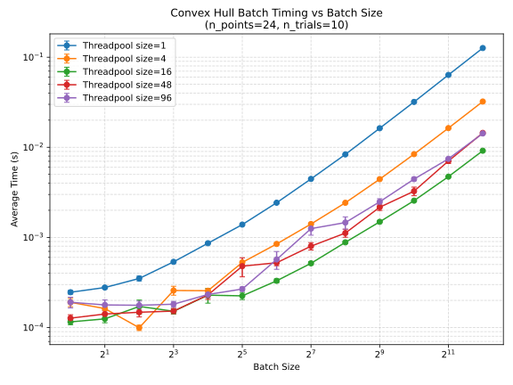

# PyQhull - Convex Hull Batch Processing

A Python library that provides efficient batch convex hull computation for 3D points using the qhull library and thread pool parallelization.

## Features

- Batch processing of multiple point clouds
- Thread pool for parallel computation
- Built on the robust qhull library

## Installation

1. Install dependencies:
```bash
# Install qhull development package
sudo apt-get install libqhull-dev  # Ubuntu/Debian
# or
sudo dnf install qhull-devel       # Fedora
# or
micromamba install pybind11 libqhull

# Install Python dependencies
pip install -r requirements.txt
```

2. Build and install:
```bash
pip install .
```

## Usage and Testing

```bash
python test_pyqhull.py
```


```
Threadpool | Batch Size | Avg Time (s) | Stderr Time (s)
-------------------------------------------------------
        1 |         1 |    0.000239 |       0.000007
        1 |         2 |    0.000295 |       0.000019
        1 |         4 |    0.000342 |       0.000011
        1 |         8 |    0.000517 |       0.000017
        1 |        16 |    0.000845 |       0.000008
        1 |        32 |    0.001392 |       0.000010
        1 |        64 |    0.002420 |       0.000024
        1 |       128 |    0.004446 |       0.000021
        1 |       256 |    0.008318 |       0.000015
        1 |       512 |    0.016215 |       0.000038
        1 |      1024 |    0.031808 |       0.000045
        1 |      2048 |    0.063153 |       0.000054
        1 |      4096 |    0.126001 |       0.000113
        4 |         1 |    0.000199 |       0.000015
        4 |         2 |    0.000132 |       0.000022
        4 |         4 |    0.000195 |       0.000017
        4 |         8 |    0.000201 |       0.000017
        4 |        16 |    0.000374 |       0.000031
        4 |        32 |    0.000479 |       0.000028
        4 |        64 |    0.000851 |       0.000022
        4 |       128 |    0.001408 |       0.000011
        4 |       256 |    0.002431 |       0.000016
        4 |       512 |    0.004410 |       0.000016
        4 |      1024 |    0.008379 |       0.000027
        4 |      2048 |    0.016244 |       0.000019
        4 |      4096 |    0.032122 |       0.000052
       16 |         1 |    0.000136 |       0.000024
       16 |         2 |    0.000108 |       0.000005
       16 |         4 |    0.000148 |       0.000017
       16 |         8 |    0.000159 |       0.000017
       16 |        16 |    0.000201 |       0.000021
       16 |        32 |    0.000207 |       0.000023
       16 |        64 |    0.000400 |       0.000060
       16 |       128 |    0.000554 |       0.000023
       16 |       256 |    0.000888 |       0.000024
       16 |       512 |    0.001486 |       0.000022
       16 |      1024 |    0.002599 |       0.000033
       16 |      2048 |    0.004648 |       0.000043
       16 |      4096 |    0.009094 |       0.000105
       64 |         1 |    0.000143 |       0.000012
       64 |         2 |    0.000172 |       0.000033
       64 |         4 |    0.000146 |       0.000014
       64 |         8 |    0.000159 |       0.000018
       64 |        16 |    0.000206 |       0.000030
       64 |        32 |    0.000590 |       0.000267
       64 |        64 |    0.000557 |       0.000105
       64 |       128 |    0.000887 |       0.000075
       64 |       256 |    0.001027 |       0.000099
       64 |       512 |    0.001941 |       0.000317
       64 |      1024 |    0.003286 |       0.000277
       64 |      2048 |    0.006420 |       0.000389
       64 |      4096 |    0.012534 |       0.000199
```

```
Threadpool | Batch Size | Avg Time (s) | Stderr Time (s)
-------------------------------------------------------
        1 |         1 |    0.000450 |       0.000025
        1 |         2 |    0.000632 |       0.000029
        1 |         4 |    0.001043 |       0.000014
        1 |         8 |    0.001834 |       0.000028
        1 |        16 |    0.003349 |       0.000013
        1 |        32 |    0.006338 |       0.000036
        1 |        64 |    0.012222 |       0.000050
        1 |       128 |    0.024085 |       0.000046
        1 |       256 |    0.047796 |       0.000080
        1 |       512 |    0.095023 |       0.000122
        1 |      1024 |    0.189710 |       0.000194
        1 |      2048 |    0.378532 |       0.000445
        1 |      4096 |    0.756263 |       0.000627
        4 |         1 |    0.000400 |       0.000018
        4 |         2 |    0.000395 |       0.000032
        4 |         4 |    0.000445 |       0.000008
        4 |         8 |    0.000657 |       0.000007
        4 |        16 |    0.001062 |       0.000017
        4 |        32 |    0.001854 |       0.000020
        4 |        64 |    0.003397 |       0.000013
        4 |       128 |    0.006446 |       0.000023
        4 |       256 |    0.012485 |       0.000031
        4 |       512 |    0.024312 |       0.000034
        4 |      1024 |    0.048147 |       0.000076
        4 |      2048 |    0.095628 |       0.000064
        4 |      4096 |    0.190567 |       0.000175
       16 |         1 |    0.000313 |       0.000024
       16 |         2 |    0.000301 |       0.000009
       16 |         4 |    0.000325 |       0.000015
       16 |         8 |    0.000362 |       0.000022
       16 |        16 |    0.000633 |       0.000135
       16 |        32 |    0.000701 |       0.000010
       16 |        64 |    0.001146 |       0.000025
       16 |       128 |    0.001946 |       0.000016
       16 |       256 |    0.003505 |       0.000017
       16 |       512 |    0.006559 |       0.000025
       16 |      1024 |    0.012595 |       0.000018
       16 |      2048 |    0.024629 |       0.000025
       16 |      4096 |    0.048726 |       0.000051
       48 |         1 |    0.000402 |       0.000094
       48 |         2 |    0.000316 |       0.000006
       48 |         4 |    0.000376 |       0.000015
       48 |         8 |    0.000382 |       0.000018
       48 |        16 |    0.000472 |       0.000030
       48 |        32 |    0.000653 |       0.000094
       48 |        64 |    0.001007 |       0.000132
       48 |       128 |    0.001138 |       0.000055
       48 |       256 |    0.001836 |       0.000074
       48 |       512 |    0.003054 |       0.000030
       48 |      1024 |    0.005452 |       0.000030
       48 |      2048 |    0.010419 |       0.000015
       48 |      4096 |    0.020342 |       0.000131
       96 |         1 |    0.000339 |       0.000013
       96 |         2 |    0.000330 |       0.000005
       96 |         4 |    0.000368 |       0.000015
       96 |         8 |    0.000444 |       0.000032
       96 |        16 |    0.000517 |       0.000030
       96 |        32 |    0.000602 |       0.000016
       96 |        64 |    0.001198 |       0.000276
       96 |       128 |    0.001560 |       0.000310
       96 |       256 |    0.001885 |       0.000086
       96 |       512 |    0.002863 |       0.000114
       96 |      1024 |    0.005077 |       0.000280
       96 |      2048 |    0.009011 |       0.000284
       96 |      4096 |    0.016376 |       0.000235
```